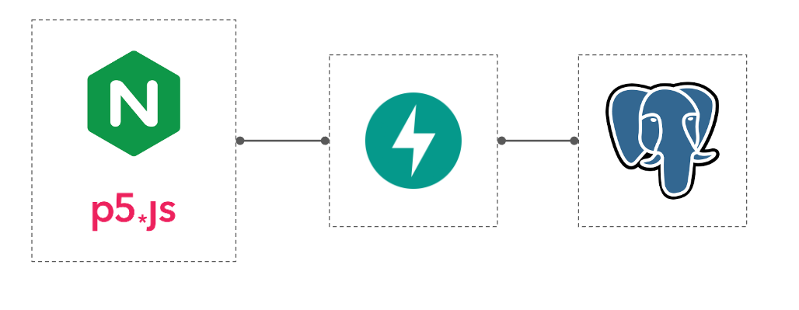

# Demo K8s/AWS

A simple demo designed to showcase how we can deploy an app using the free tier 
of AWS

## Objectives:
* Single file per technology
* Deploy Kubernetes cluster on AWS

## Architecture

### Software
**Frontend**: Nginx + P5JS
**Backend**: FastAPI
**Database**: PostgreSQL

### Hardware
Single master node and single worker node. Each with 1 CPU with 1GiB RAM (AWS t2-micro)
Master node handles system critical deployments and worker node handles app deployment.

